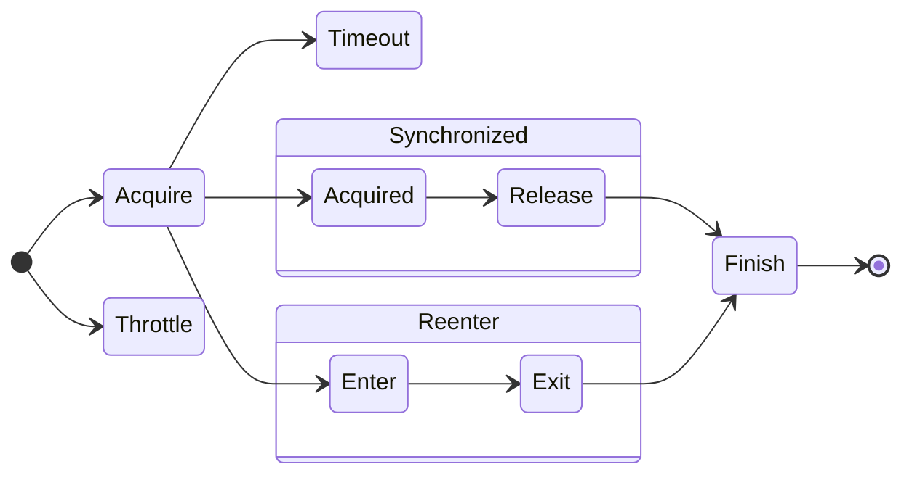

# ya-syn

Yet Another Synchronizer for TypeScript.

- Promise based synchronization
- Concurrency setting to support lock(n==1) and semaphore(n>1)
- Reentrant synchronization (nodejs only at this point)
- Timeout
- Throttling
- Logging



# How to install

```shell
npm install ya-syn
```

## Use cases

- Please check test/samples for all the use cases

### Use case:  [Global Synchronizer Provider](test/samples/global-sychronizer-provider.test.ts)

- It is recommended to create global synchronizer provider to configure ids and logging in one place.

### Use case:  [Lock](test/samples/lock.test.ts)

- Simple reentrant lock. concurrency == 1

### Use case: [Semaphore](test/samples/semaphore.test.ts)

- Simple reentrant semaphore. concurrency > 1

### Use case: [Class Synchronizer](test/samples/lock-by-class.test.ts)

- You can obtain synchronizer for given class

### Use case: [Instance Synchronizer](test/samples/lock-by-instance.test.ts)

- You can obtain synchronizer for given class
- Synchroinzer provider keeps weak ref to the key object. When the object get freed, synchronizer instance will be freed too

### Use case: [Key Synchronizer](test/samples/lock-by-key.test.ts)

- synchronizer provider keeps string to synchronizer map
  - Note: This mapping is not weak reference.
- You can nest multiple synchronizer
    - Main synchronizer to limit number of concurrent requests to 3
    - Per host synchronizer to limit number of concurrent requests to same host to 1

### Use case: [CacheProvider](test/samples/cache-provider.test.ts)

- Object cache with asynchronous factory callback
- You can specify default TTL
- You can override ttl when you get cache

# Other useful components

## [LazyInitializer](src/LazyInitializer.ts)

- Provider class with asynchronous factory callback.

### Use case: [Async Singleton](test/samples/async-singleton.test.ts)

- You can create top level singleton instance with asynchronous initialization
- factory method is called only once

### Use case: [Async Instance Variable](test/samples/async-instance-variable.test.ts)

- You can create instance variable which require asynchronous initialization.

### Use case: [Async Class Variable](test/samples/async-class-variable.test.ts)

- You can create class variable which require asynchronous initialization.

# Version History

- 1.0.1
  - Update README
- 1.0.0
  - Initial Release

# Next Step

- Add good way to free unused string keyed synchronizer
- Support reentrant synchronization on web browser

# License

This project is under the MIT license.
Copyright (c) 2024 Tomohisa Ota