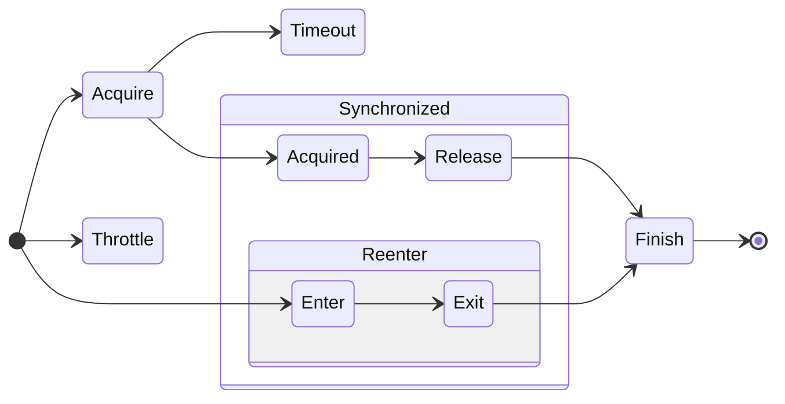

# ya-syn

Yet Another Synchronizer for TypeScript.

- Promise based synchronization
- Concurrency setting to support lock(n==1) and semaphore(n>1)
- Reentrant synchronization (nodejs only at this point)
- Timeout
- Throttling
- Logging



# How to install

```shell
npm install ya-syn
```

# Documentation

For detailed architecture, usage examples, and API documentation, please visit our **[Wiki](https://github.com/tomohisaota/ya-syn/wiki)**:

- **[🇺🇸 English Documentation](https://github.com/tomohisaota/ya-syn/wiki/English)**
- **[🇯🇵 日本語ドキュメント](https://github.com/tomohisaota/ya-syn/wiki/日本語)**

The wiki includes:
- **Architecture Overview**: Core Semaphore, Semaphore, Synchronizer design patterns
- **SynchronizerProvider**: Factory pattern for managing synchronizers with `forKey()` and `forObject()`
- **Synchronizer**: High-level interface with timeout, throttle, event monitoring, and statistics
- **LazyInitializer**: Async singleton pattern with reentrancy detection
- **CachedProvider**: TTL-based async cache with Double-Check Locking pattern
- **WeakIndexMap**: Weak reference map for managing objects by parameters
- **TaskExecutor**: Async generator-based task processing with concurrency control
- **Practical Examples**: API rate limiting, database connection pools, batch processing, and more

# Version History
- 1.6.0
  - Add WeakIndexMap
- 1.5.0
  - Add Process Monitor
- 1.4.2
  - Fix bug in waitCompleteAll
- 1.4.1
  - Fix resource leak in reentrant check
- 1.4.0
  - Add waitComplete/waitCompleteAll handlers to CoreSemaphore
  - Restructure task executor by replace Synchronizer with CoreSemaphore
- 1.3.4
  - Update Core Semaphore method signature
- 1.3.3
  - Expose Core Semaphore
- 1.3.2
  - Reduce memory usage
- 1.3.1
    - Add eager option to LazyInitializer
    - Fix bug that executor doesn't wait until all tasks completes
- 1.3.0
    - Add mergeAsyncGenerators to enhance task executor
- 1.2.0
    - Added Task Executor
- 1.1.2
    - Use weak ref for string key based synchronizer provider
    - Set default provider/synchronizer/execution id to uuid
- 1.1.1
    - Fix bug in handling reenter with throttling
- 1.1.0
    - Add capture utility method to CachedProvider(#5)
    - Add reentrant entry detector to LazyInitializer(#3)
- 1.0.1
    - Fix event handling leak
- 1.0.0
    - Initial Release

# Next Step

- Support reentrant synchronization on web browser

# License

This project is under the MIT license.
Copyright (c) 2024 Tomohisa Ota